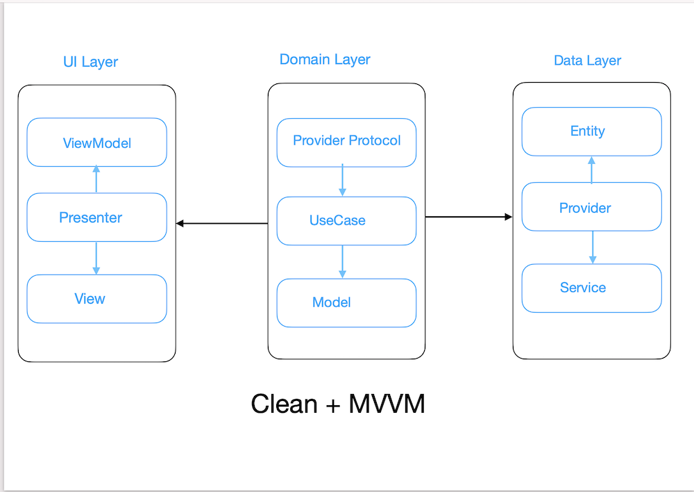

# MarvelCharacters
App that displays all marvel superheros with number of available comics, stories, series and events.

Dependencies added for via Swift package dependency: 
* Moya: for network calls
* SDWebImage: for loading remote images

## Sample Documents:
It has screenshots of all app screens..

-[MainView](./MarvelCharacters/MarvelCharacters/Documentation/Mainview.png)

-[Character List](./MarvelCharacters/MarvelCharacters/Documentation/listOfCharacters.png)

-[Character Details](./MarvelCharacters/MarvelCharacters/Documentation/CharacterDetails.png)

## Architecture:
Architecture overview diagram.

## Architecture Explanation:
There are three Layers which has sub components which communicates to fetch data from server to front end.
- Data
- Domain
- Presentation

#### Data Layer:
It consists of Entity which consist exact structure like json, Service which consists of API related parameters like headers, path etc And lastly provider which is communicator it takes all necessary parameters from service and passes through entity.

#### Domain Layer:
It consists of UseCase if API call has unique usecase which gets passed throgh provider protocol and converts entity data into modular form where we can convert raw data into readable models

#### Presentation layer:
This is main layer that is the front end. It manipulates all data to be shown in required format.
The view is the purely UI part and presenters that contains all business logic or ViewModels are the containers which holds data as exact as required by view.

